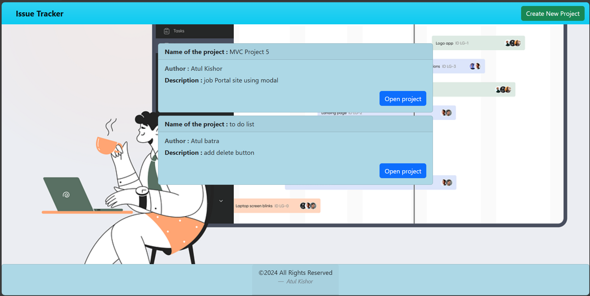
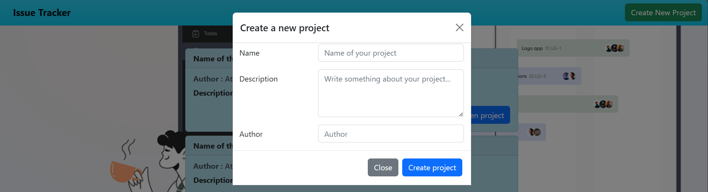
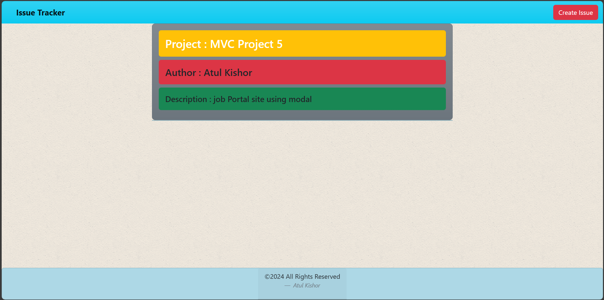
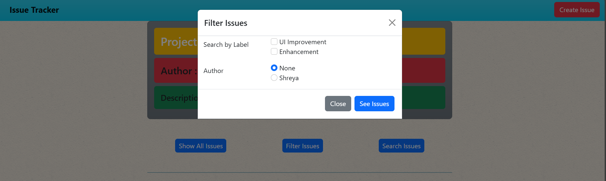
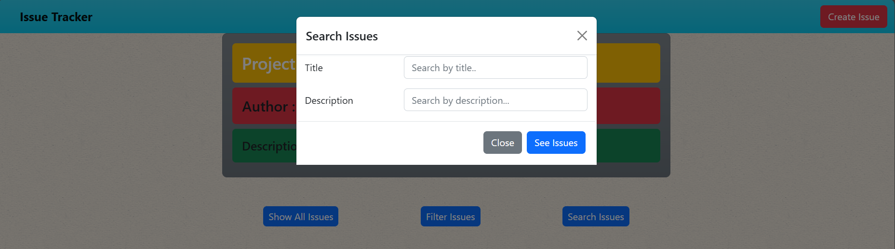
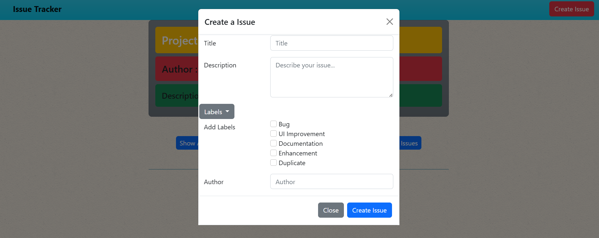

# Issue Tracker

This is an issue tracker application built using Node.js and EJS. It allows users to track issues/bugs for different projects. The application provides a user interface to create projects, view project details, filter issues, and create new issues.

## Features
- **Neat UI**: A home page showing a list of projects.
- **Project Creation**: Ability to create a new project with name, description, and author.
- **Project Details**: A detail page to view bugs related to a specific project.
- **Issue Filtering**: Filter issues by multiple labels, author, and search by title and description.
- **Issue Creation**: Create new issues for a project with a title, description, labels, and author.

## Screenshots

### Home Page


### Create Project


### Project Detail Page


### Filter Issues


### Search Issues


### Create Issue



## Prerequisites
- Node.js (version X.X.X)
- npm (version X.X.X)

## Installation
1. **Clone the repository**
    ```bash
    git clone https://github.com/AtulKishor/CN-Issue-Tracker.git
    ```

2. **Navigate to the project directory**
    ```bash
    cd CN-Issue-Tracker
    ```

3. **Install the dependencies**
    ```bash
    npm install
    ```

4. **Start the application**
    ```bash
    nodemon index.js
    ```

## Hosted Application
The application is hosted at: [Issue Tracker](https://cn-issue-tracker-8kx1.onrender.com/)

